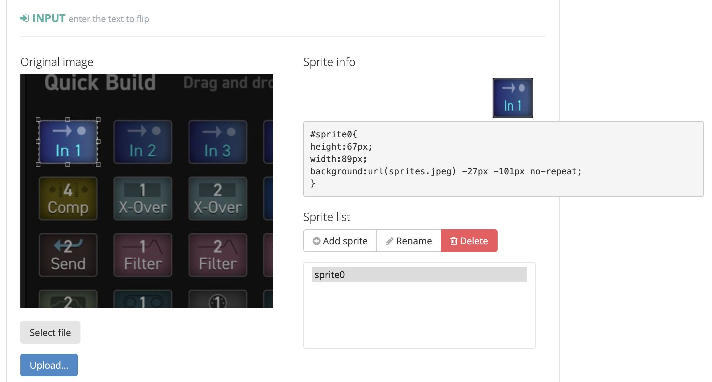
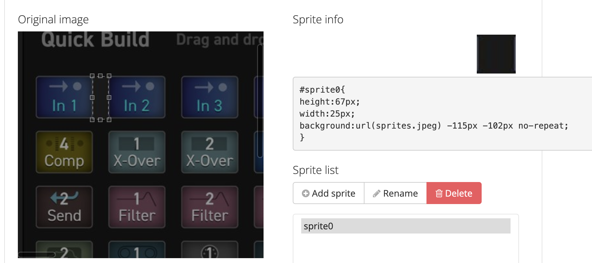
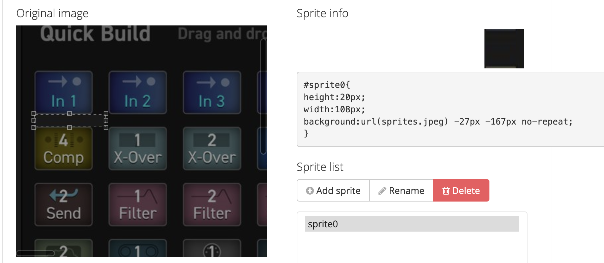

## Generate sprites 

### Calculate block dimension


Visit page and upload the image at:
https://www.web2generators.com/graphism-tools/css-sprite-creator

with the select-tool draw the block and grab the position, dimension and spacings from generated CSS defintion.

e.g:
```css
#sprite_block{
height:67px;
width:89px;
background:url(sprites.jpeg) -27px -101px no-repeat;
}

#sprite_spacing_right{
height:67px;
width:25px;
background:url(sprites.jpeg) -115px -102px no-repeat;
}

#sprite_spacing_bottom{
height:20px;
width:108px;
background:url(sprites.jpeg) -27px -167px no-repeat;
}
```

#### Position and dimension
Select block to get the position and dimension:


The `height` and `widht` do reprensent the dimensions while
the `background:.. Xpx Ypx` gives the left and top position.

#### Spacing right
Spacing right:


The `width` represents the spacing to next block at the right.

#### Spacing bottom
Spacing bottom:


The `height` represents the spacing next block at to the bottom.

### Generate CSS and demo size

In script `./generate.js` fill in the image-source, dimensions and spacings
```js
const imageSrc = './sprites.jpeg'
const top = -101
const left = -27
const blockHeight = 67
const blockWidth = 89
const marginRight = 25
const marginBottom = 20
```

then run in terminal : 
```bash
$ ./generate.js
```

and open the page `sprites.html` to preview and grab the generated css from `sprites.css`


### Reduce size
If you need to reduce the size of the image, you may do it here:

https://www.img2go.com

